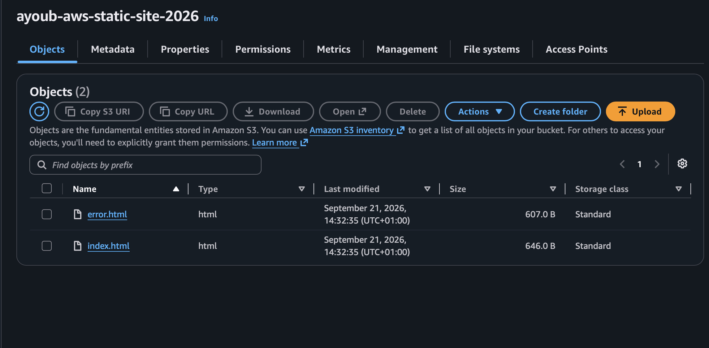
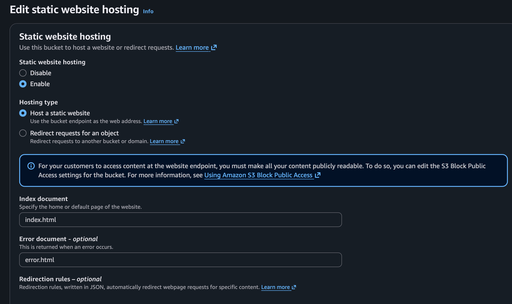
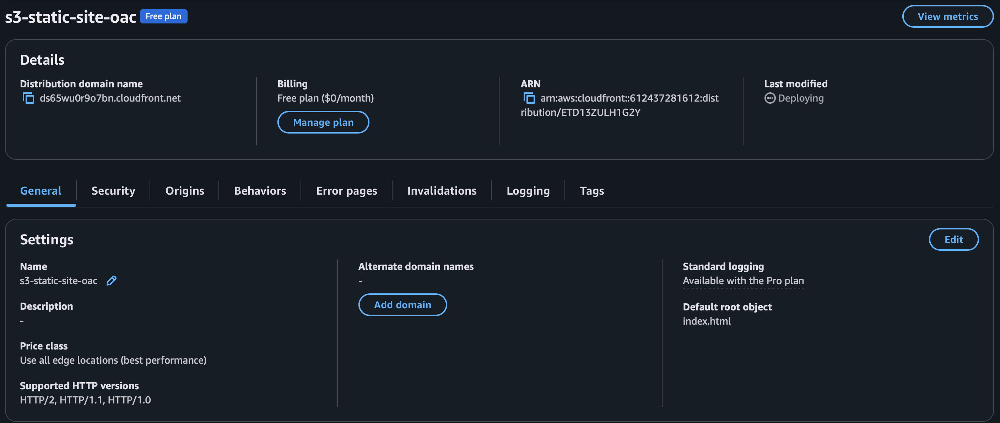
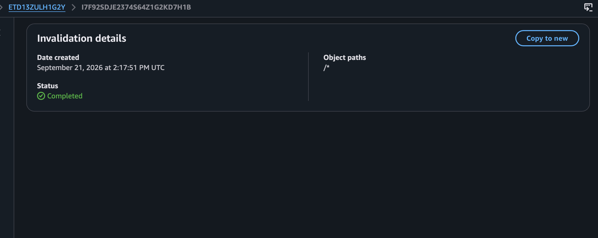
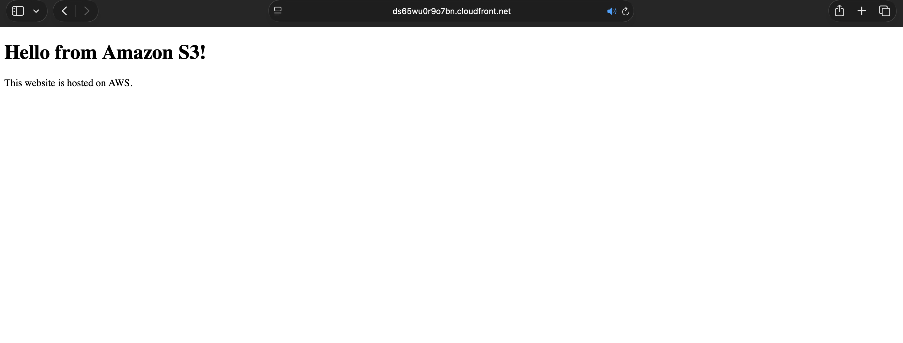
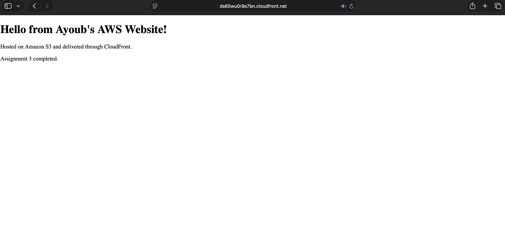

# AWS S3 & CloudFront Static Website Lab

## Overview

This project demonstrates the deployment of a static website using Amazon S3 and Amazon CloudFront.

The objective was to store website files in an S3 bucket and use CloudFront as a Content Delivery Network (CDN) to securely deliver the website over HTTPS.

The project also demonstrates CloudFront caching and cache invalidation when website content is updated.

## Architecture

The architecture consists of:

- Amazon S3
- Amazon CloudFront
- S3 Origin Access Control (OAC)
- HTTPS
- CloudFront caching
- CloudFront cache invalidation
- Static HTML website

The architecture follows:

User → CloudFront → S3

## S3 Bucket

A general-purpose S3 bucket was created to store the static website files.

The bucket was configured in the `eu-north-1` (Stockholm) AWS region.

The bucket contains:

- `index.html`
- `error.html`

## Static Website Hosting

Static website hosting was enabled for the S3 bucket.

The index document was configured as:

`index.html`

The error document was configured as:

`error.html`

## CloudFront Distribution

An Amazon CloudFront distribution was created with the S3 bucket configured as the origin.

CloudFront provides a globally distributed delivery layer in front of the S3 bucket and delivers the website over HTTPS.

The default root object was configured as:

`index.html`

## Origin Access Control

CloudFront was configured with Origin Access Control (OAC) to securely access the S3 bucket.

OAC allows CloudFront to retrieve objects from the S3 origin without requiring the S3 bucket itself to be publicly accessible.

The resulting architecture is:

User → CloudFront → S3

## HTTPS

CloudFront provides HTTPS access to the static website using the default CloudFront SSL/TLS certificate.

The website can therefore be accessed securely using the CloudFront distribution domain.

## CloudFront Caching

CloudFront caches content from the S3 origin.

This means that when a user requests an object, CloudFront can serve a cached copy rather than retrieving the object from S3 every time.

This improves content delivery and reduces repeated requests to the origin.

## CloudFront Cache Invalidation

When the website content was updated, a CloudFront invalidation was created using:

`/*`

This removes cached copies so CloudFront can retrieve the latest content from the S3 origin.

## Testing the Website

The website was successfully accessed through the CloudFront distribution domain.

The browser request was sent to CloudFront, which retrieved the website content from the S3 origin.

## Updating the Website

The `index.html` file was modified and uploaded to the S3 bucket.

A CloudFront invalidation was then created to remove the previous cached version.

After the invalidation completed, the CloudFront URL displayed the updated website content.

This demonstrated the relationship between updating the S3 object, CloudFront caching, and cache invalidation.

## Route 53

A custom domain was not configured for this project because a domain name was not available.

The Route 53 portion of the assignment was therefore skipped.

The completed architecture uses the CloudFront distribution domain directly.

A future implementation could add Route 53 to provide a custom domain:

Custom Domain → Route 53 → CloudFront → S3

## What I Learned

This project provided hands-on experience with:

- Amazon S3
- Static website hosting
- Amazon CloudFront
- Content Delivery Networks (CDNs)
- Origin Access Control
- HTTPS
- CloudFront caching
- Cache invalidation
- AWS object storage
- Serving static content through AWS

One of the main concepts demonstrated was the difference between the origin and the delivery layer.

S3 stores the website files, while CloudFront sits in front of S3 and delivers those files to users.

## Final Architecture

User
↓
CloudFront
↓
S3 Bucket
↓
index.html / error.html

## Next Step

This project forms part of my AWS and DevOps learning journey.

The next stage is to move from manually creating AWS infrastructure through the AWS Console to managing infrastructure as code using Terraform.
